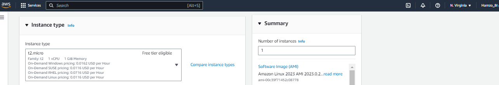
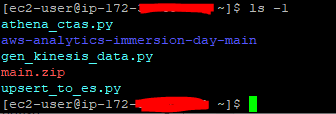

# Build-BI-System-from-Scratch

The purpose of this lab is to implement a Businesss Intelligence(BI) System using AWS Analytics Services.
will set up a Data ``Collection -> Store -> Analysis/Processing -> Visualization`` pipeline.

we are going to implement the following Businesss Intelligence(BI) System using AWS Analytics Services.

Amazon Kinesis Data Streams and Kinesis Data Firehose are used for data collection. Amazon S3 is for data storage. AWS Lambda, Amazon Athena, and Amazon Elasticsearch Service are for data analysis and processing. Amazon QuickSight and Kibana are for Visualization.


## Creating an IAM User

- Create an IAM user and allow ``AdministratorAccess`` permissions.
- Make sure to choose both ``Programmatic access`` and ``AWS Management Console access``.
- Download the new user's credentials.


## Creating Security Groups

### Security Group for EC2 instance as a bastion host
We will create a security group to use with an Amazon EC2 instance which will serve as a bastion host.

**Basic details**
- Security group name : ``bastion``
- Description : ``security group for bastion``

**Inbound rules**
- Type : SSH
- Protocol : TCP
- Port Range : 22
- Source : ``Your network's public IPv4 address range``


### Security Group for use with Elasticsearch Service
**Basic Details**
- Security group name : ``use-es-cluster-sg``
- Description : ``security group for an es client``

**Inbound rules** Leave empty.


### A other Security Group 
**Basic details**
- Security group name : ``es-cluster-sg``
- Description : ``security group for an es cluster``

**Inbound rules**
- Type : All TCP
- Protocol : TCP
- Port Range : 0-65535
- Source : ``use-es-cluster-sg`` from the dropdown list. For example: sg-038b632ef1825cb7f
**Outbound rules** Leave at default values.


## Launch an EC2 Instance
We will create an EC2 instance that will run code to generate the data needed for the lab.

- Choose an Amazon Machine Image (AMI).
- Choose Amazon Linux 2 AMI (HVM), SSD Volume Type.
- Select t2.micro as the instance type
- Select an existing security group from Assign a security group, and select bastion and use-es-cluster-sg from the Security Group table.
- Create a key pair to access EC2 Instance.





## Configuring your EC2 Instance
In this step we will configure the EC2 instance to access and control other AWS resources.


Enter the following commands once you are logged into the EC2 instance:
(1) Download the source code.

```
wget 'https://github.com/aws-samples/aws-analytics-immersion-day/archive/refs/heads/main.zip'
```


(2) Extract the downloaded source code.
```
unzip -u main.zip
```


(3) Grant execution authority to the practice environment setting script.
```
chmod +x ./aws-analytics-immersion-day-main/set-up-hands-on-lab.sh
```
(4) Execute the setup script to set the lab environment.
```
./aws-analytics-immersion-day-main/set-up-hands-on-lab.sh
```


(5) Make sure the files necessary for the lab are normally created after running the configuration script. For example, check if the source code and necessary files exist as shown below.
```
[ec2-user@ip-172-31-2-252 ~]$ ls -1
athena_ctas.py
aws-analytics-immersion-day-main
gen_kinesis_data.py
main.zip
upsert_to_es.py
```


In order to run the Python synthentic data generator script (``gen_kinesis_data.py``), we need to set user credentials by following the instructions:

Perform aws configure to access other AWS resources. At this time, the IAM User data created earlier is used. Open the previously downloaded .csv file, check the Access key ID and Secret access key, and enter them.

```
$ aws configure
AWS Access Key ID [None]: <Access key ID>
AWS Secret Access Key [None]: <Secret access key>
Default region name [None]: us-east-1
Default output format [None]:
```
If the setting is complete, the information entered as follows will be masked.
```
$ aws configure
AWS Access Key ID [****************EETA]:
AWS Secret Access Key [****************CixY]:
Default region name [None]: us-east-1
Default output format [None]:
```


## Build up Data Analytics System
We are now ready to build a data analysis system using the AWS Analytics services. 


### Create Kinesis Data Stream to receive input dataHeader anchor link
- Select Kinesis from the list of services on the AWS Management Console.
- Make sure the Kinesis Data Streams radio button is selected and click Create data stream button.
- Enter retail-trans as the Data stream name.
- Choose either the On-demand or Provisioned capacity mode. With the On-demand mode, you can then choose Create Kinesis stream to create your data stream. With the Provisioned mode, you must then specify the number of shards you need, and then choose Create Kinesis stream. If you choose Provisioned mode, enter 1 in Number of open shards under Data stream capacity.
- Click the Create data stream button and wait for the status of the created kinesis stream to become active.


### Create Kinesis Data Firehose to store data in S3Header anchor link
Kinesis Data Firehose will allow collecting data in real-time and batch it to load into a storage location such as Amazon S3, Amazon Redshift or ElasticSearch.

If you are on the Kinesis Data Stream page from the previous step, select Delivery streams from the left sidebar. If you are starting from the Kinesis landing page, select the Kinesis Data Firehose radio button and click the Create delivery stream button.

(Step 1: Name and source) For Delivery stream name enter retail-trans.

Under Choose a source, select the Kinesis Data Stream radio button and choose retail-trans stream that you created earlier from the dropdown list. Click Next. If you do not see your data stream listed, make sure you are in Oregon region and your data stream from previous step is in Active state.

Select Amazon S3 as Destination and click Create new to create a new S3 bucket

S3 bucket names are globally unique, so choose a bucket name that is unique for you. You can call it aws-analytics-immersion-day-xxxxxxxx where xxxxxxxx is a series of random numbers or characters of your choice.


Under S3 Prefix, copy and paste the following text exactly as shown.
```
json-data/year=!{timestamp:yyyy}/month=!{timestamp:MM}/day=!{timestamp:dd}/hour=!{timestamp:HH}/
```
Under S3 error prefix, copy and paste the following text exactly as shown.
```
error-json/year=!{timestamp:yyyy}/month=!{timestamp:MM}/day=!{timestamp:dd}/hour=!{timestamp:HH}/!{firehose:error-output-type}
```
Set buffer size to 1 MB and buffer interval to 60 seconds in S3 buffer conditions.

Under Permissions IAM role, select Create or update IAM role


Click the Create delivery stream button to complete the Firehose creation.

### Verify data pipeline operationHeader anchor link

In this step, we will generate sample data and verify it is being processed and stored as follows- ``Kinesis Data Streams -> Kinesis Data Firehose -> S3``.

Connect by SSH to the previously created E2 instance.
Run the gen_kinesis_data.py script on the EC2 instance by entering the following command:
```
python3 gen_kinesis_data.py \
  --region-name us-east-1 \
  --service-name kinesis \
  --stream-name retail-trans
```


Verify that data is generated every second. Let it run for about one minute and terminate the script. You can enter Ctrl+C to end the script execution.
```
[ec2-user@ip-172-31-2-252 ~]$ python3 gen_kinesis_data.py --region-name us-east-1 --service-name kinesis --stream-name retail-trans --max-count 100
[INFO] 10 records are processed
[INFO] 20 records are processed
[INFO] 30 records are processed
[INFO] 40 records are processed
[INFO] 50 records are processed
[INFO] 60 records are processed
[INFO] 70 records are processed
[INFO] 80 records are processed
[INFO] 90 records are processed
[INFO] 100 records are processed
[INFO] Total 100 records are processed
```


After 5~10 minutes, go to S3 service and open the bucket you created earlier. You can see that the original data has been delivered by Kinesis Data Firehose to S3 and stored in a folder structure by year, month, day, and hour.*


### Analyze data using Athena
Using Amazon Athena, you can create tables based on data stored in S3, query those tables using SQL, and view query results.


